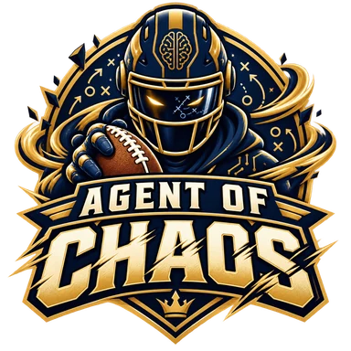
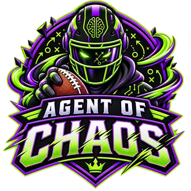

# Agent of Chaos Fantasy Manager

An AI-powered fantasy football manager for two teams in two private Yahoo Fantasy Football leagues.

| Family league | Friends league |
| --- | --- |
|  |  |

## Project status

This is a personal, non-commercial experiment. The initial Yahoo integration is intentionally **read-only**: it analyzes league settings, rosters, matchups, player availability, standings, waiver information, and transaction history, then produces independent recommendations for each team. Recommended lineup, waiver, and draft actions are reviewed and entered manually in Yahoo.

Yahoo currently reviews Fantasy Sports API applications individually and provides read-only access by default. Any future write capability will be added only if Yahoo explicitly approves it.

The first version of the football brain is now implemented. Its draft engine ranks the live board using league-specific replacement value, roster construction, tier scarcity, ADP, survival to the next pick, upside, risk, and bye-week fit. Every recommendation includes a score breakdown and ranked alternatives.

## Architecture

One shared football-intelligence layer manages two completely isolated team profiles:

```text
Shared football intelligence
├── Family league → isolated rules, roster, budget, history, and decisions
└── Friends league → isolated rules, roster, budget, history, and decisions
```

Each team maintains its own Yahoo identifiers, league rules, roster, waiver priority, FAAB balance, decision history, OpenAI state, and approval settings. Private information from one league is never used as context for the other.

See [docs/ARCHITECTURE.md](docs/ARCHITECTURE.md) for the design and operating modes.
The manager's decision principles are defined in [docs/STRATEGY_CONSTITUTION.md](docs/STRATEGY_CONSTITUTION.md).

## Safety and privacy

- Yahoo connects through OAuth 2.0; passwords are never provided to the application.
- API keys, client secrets, access tokens, and refresh tokens remain in local environment configuration.
- Secrets, private league exports, and local data are excluded from version control.
- Dry-run is the default operating mode.
- Trades and other high-impact actions require human approval.
- The application does not sell, redistribute, or publicly expose Yahoo Fantasy data.

See [SECURITY.md](SECURITY.md) for credential handling and vulnerability reporting.

## Current capabilities

- Validate a league-specific draft board and roster state.
- Recalculate available-player value at each pick.
- Adjust quarterback priority for superflex leagues.
- Shift from foundational value to late-round upside as the draft progresses.
- Delay kickers and defenses until the final two rounds.
- Return an auditable primary pick, alternatives, exclusions, and confidence score.
- Maintain an explicit family or friends team boundary on every draft request.

Run the included demonstration after installation:

```text
agent-of-chaos draft-recommend examples/draft_request.example.json
```

## Next capabilities

- Import league rules, teams, rosters, and scoring settings.
- Connect current projections, ADP, injuries, and news to the draft engine.
- Track the Yahoo live draft board when permitted by available access.
- Recommend weekly lineups.
- Analyze waivers, injuries, matchups, and FAAB bids.
- Maintain separate decision histories for both teams.
- Provide an auditable explanation for every recommendation.
- Support supervised Yahoo actions only if authorized write access becomes available.

## Local setup

1. Install Python 3.11 or newer.
2. Create a virtual environment.
3. Install the project with development dependencies: `pip install -e ".[dev]"`.
4. Copy `.env.example` to `.env`.
5. Add the OpenAI API key and Yahoo OAuth credentials locally.
6. Keep `EXECUTION_MODE=dry_run` during development and testing.
7. Run the tests with `pytest`.

Never commit `.env` or token files.

## Disclaimer

This project is not affiliated with, endorsed by, or sponsored by Yahoo, the National Football League, or OpenAI. Yahoo Fantasy data is accessed only for the authorized account and subject to Yahoo's applicable developer terms and policies.
